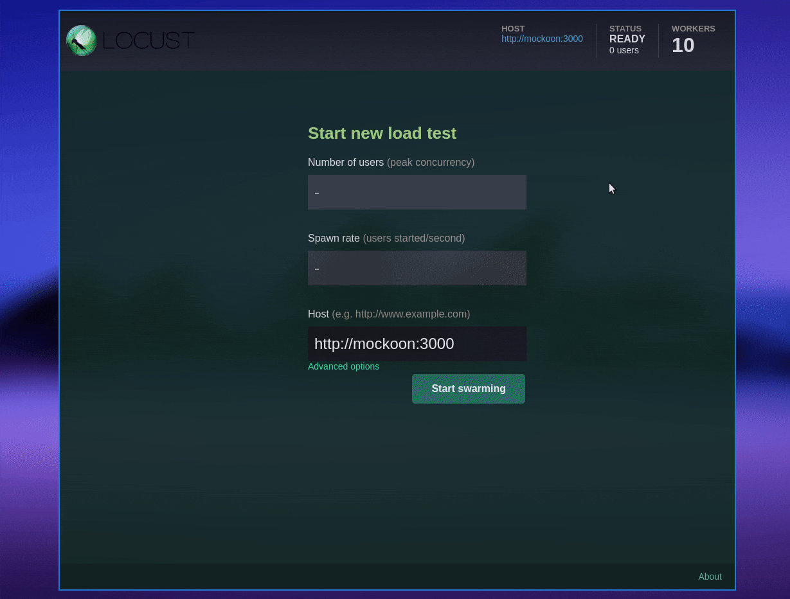
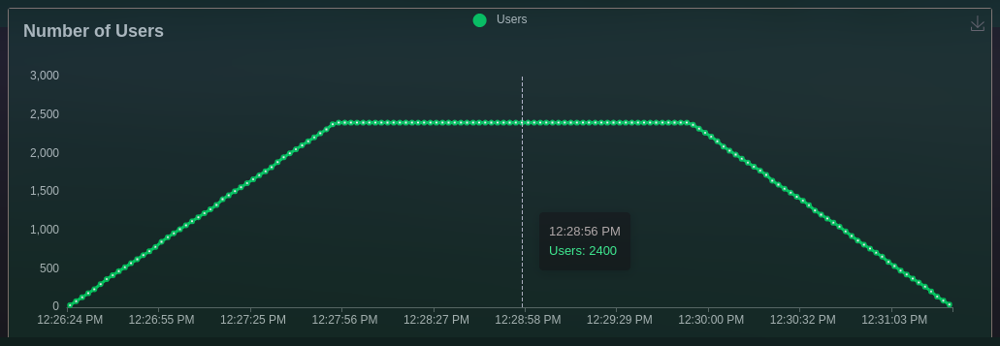
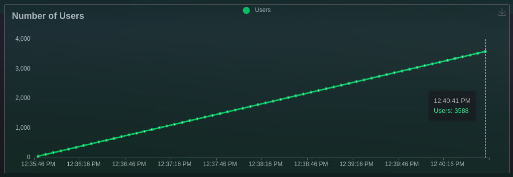
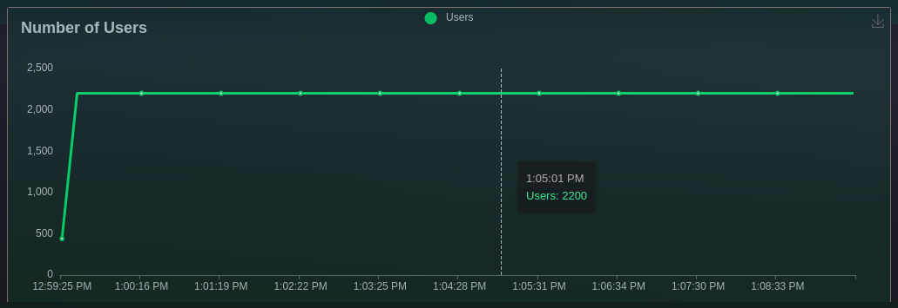
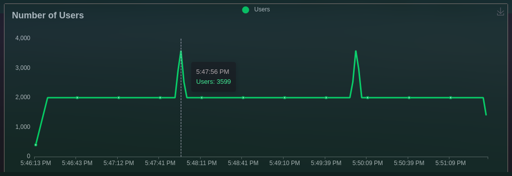

# Performance testing using Locust with Python


This project is an example of the different types of performance tests that are described in
[Performance testing summary](https://github.com/eccanto/base-performance-testing-documentation) using Locust and
Docker compose.

# Table of contents

* [Get started](#get-started)
  * [Requirements](#requirements)
  * [Configuration](#configuration)
  * [Run performance testing](#run-performance-testing)
    * [Implementation of "Case 1: Load testing"](#implementation-of-case-1-load-testing)
    * [Implementation of "case 2: Stress testing"](#implementation-of-case-2-stress-testing)
    * [Implementation of "Case 3: Soak testing"](#implementation-of-case-3-soak-testing)
    * [Implementation of "Case 4: Spike testing"](#implementation-of-case-4-spike-testing)
  * [Clean environment](#crean-environment)
* [License](#license)

# Get Started

## Requirements

- [Docker +24.0.7](https://docs.docker.com/engine/install/ubuntu/)
- [Docker compose +2.21.0](https://docs.docker.com/compose/install/linux/)

## Configuration

Setup environment (start `mockoon` server) using docker compose:

```bash
docker compose --profile env up --detach
```

## Run performance testing

The following sections describe how to set up the execution environment, but do not start the test, for this you must
go to http://localhost:8089/, wait until all `10 workers` are connected and click on "**Start swarming**" button.



### Implementation of "Case 1: Load testing"

#### Run

Set `LOCUST_FILE=tests/load.py` in `.env` file:

```bash
sed -i 's/\(LOCUST_FILE=\).\+/\1tests\/load.py/' .env
```

Run load testing with `10` runners:

```bash
docker compose --profile test up --scale worker=10
```

#### Result



### Implementation of "Case 2: Stress testing"

#### Run

Set `LOCUST_FILE=tests/stress.py` in `.env` file:

```bash
sed -i 's/\(LOCUST_FILE=\).\+/\1tests\/stress.py/' .env
```

Run stress testing with `10` runners:

```bash
docker compose --profile test up --scale worker=10
```

#### Result



### Implementation of "Case 3: Soak testing"

#### Run

Set `LOCUST_FILE=tests/soak.py` in `.env` file:

```bash
sed -i 's/\(LOCUST_FILE=\).\+/\1tests\/soak.py/' .env
```

Run soak testing with `10` runners:

```bash
docker compose --profile test up --scale worker=10
```

#### Result



### Implementation of "Case 4: Spike testing"

#### Run

Set `LOCUST_FILE=tests/spike.py` in `.env` file:

```bash
sed -i 's/\(LOCUST_FILE=\).\+/\1tests\/spike.py/' .env
```

Run spike testing with `10` runners:

```bash
docker compose --profile test up --scale worker=10
```

#### Result



## Clean environment

```bash
docker compose --profile env --profile test down
```

# Static code analysis tools

TODO

# License

[MIT](./LICENSE)
