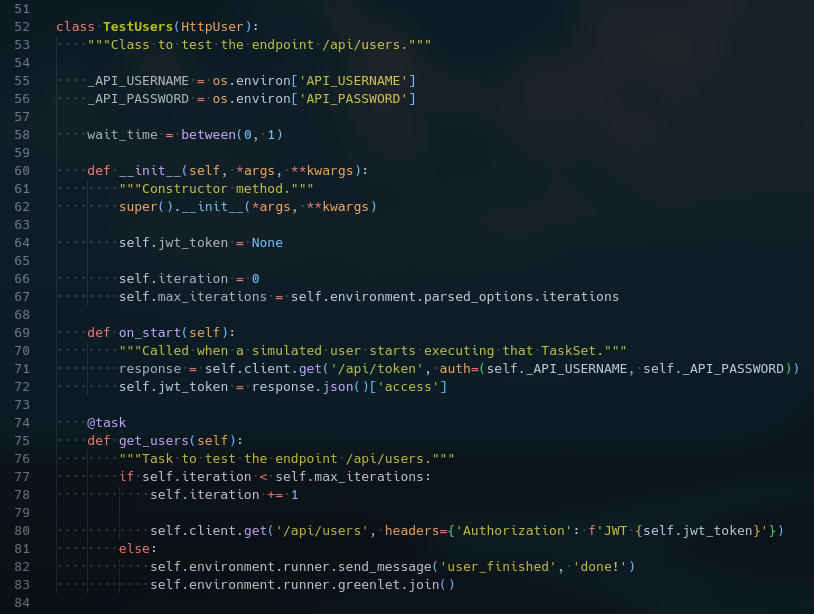
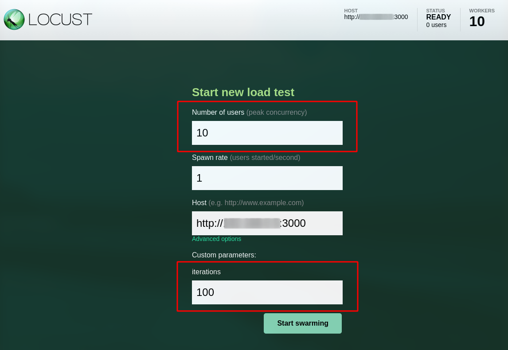

[](https://github.com/prettier/prettier)

# Load testing using Locust

# Table of contents

* [Overview](#overview)
* [Get started](#get-started)
  * [Objetive](#objetive)
  * [Locustfile](#locustfile)
  * [Requirements](#requirements)
  * [Run](#run)
* [Static code analysis tools](#static-code-analysis-tools)
  * [Set up the Git hooks custom directory](#set-up-the-git-hooks-custom-directory)
  * [Python Static Checkers](#python-static-checkers)
  * [Shell Static Checkers](#shell-static-checkers)
* [License](#license)

# Overview

[Locust](https://github.com/locustio/locust) is a Python testing tool used for load testing and user behavior simulation. Load testing is the practice of testing a software application with the primary purpose of stressing the application's capabilities.

For load testing Locust presents test results in a web dashboard. One of the significant features of Locust is its [well-documented code source](https://docs.locust.io/en/stable/).

# Get Started

In this example, you will run a login and obtain users information using [JSON Web Token](https://www.rfc-editor.org/rfc/rfc7519) Authentication. The tested application will be a REST API server mock defined in this repository: [base-mockoon-api-rest-server-mock](https://raw.githubusercontent.com/eccanto/base-mockoon-api-rest-server-mock).

## Objetive

The system will be tested with a load of `1000` requests from `10` locust **workers**: to scale up, Locust offers a set of processes called nodes that can be used to run a set of tasks. These nodes are known as workers as they perform specific functions in a given period. In addition, Locust offers the capability to link these nodes or workers to simulate a [distributed load](https://docs.locust.io/en/stable/running-distributed.html) for large-scale load testing operations.

## Locustfile

The number of requests will be controlled from [locustfile.py](./locustfile.py), because locust does not support limit of iterations/requests by default, and its options have unexpected behaviors ([locust-plugins](https://github.com/SvenskaSpel/locust-plugins)).

The following Python code represents our load testing Python example:



- `line 55-56`: Gets server credentials.
- `line 67`: Gets the value of the custom command line argument "iterations".
- `line 69`: Log in and gets the JWT from the server.
- `line 75`: Task to obtain users data from the server (must be executed `1000` times).


## Requirements

- [Docker +20.10](https://docs.docker.com/engine/install/ubuntu/)
- [docker-compose +1.29](https://docs.docker.com/desktop/install/linux-install/)

## Run

The load test will execute `1000` requests from `10` locust workers (each worker will execute `100` requests).

1. Run [REST API server mock](https://github.com/eccanto/base-mockoon-api-rest-server-mock) (address: http://localhost:3000).
2. Edit [docker-compose.yml](./docker-compose.yml):
    ```yaml
    version: '3.9'

    services:
    master:
        image: locustio/locust:2.12.1
        env_file:
        - mock_variables.env
        ports:
        - "8089:8089"
        volumes:
        - ./:/mnt/locust
        # CHANGE!: Change <LOCAL_IP>, this IP must be accessible from within a locust containers.
        # NOTE!: The flag "-i" indicates the number of iterations by user.
        command: -f /mnt/locust/locustfile.py --master -H "http://<LOCAL_IP>:3000" -i 100

    worker:
        image: locustio/locust:2.12.1
        env_file:
        - mock_variables.env
        volumes:
        - ./:/mnt/locust
        command: -f /mnt/locust/locustfile.py --worker --master-host master

    ```
3. Run locust docker containers (with `10` workers):
    ```bash
    docker-compose up --scale worker=10
    ```
4. Go to http://localhost:8089/
    

    **Note**: Total number of requests: "`Number of users` x `iterations`" = "`10` x `100` = `1000`"
5. Click on the "Start swarming" button.
    

# Static code analysis tools

These are the linters that will help us to follow good practices and style guides of our source code. We will be using the following static analysis tools, which will be executed when generating a new push in the repository (git hooks).

## Set up the Git hooks custom directory

After cloning the repository run the following command in the repository root:

```bash
git config core.hooksPath .githooks
```

## Python Static Checkers

Tools used:
- [brunette](https://github.com/odwyersoftware/brunette): A best practice Python code formatter.
- [isort](https://pycqa.github.io/isort/): Python utility / library to sort imports alphabetically, and automatically separated into sections and by type.
- [prospector](https://github.com/PyCQA/prospector): Prospector is a tool to analyse Python code and output information about errors, potential problems, convention violations and complexity.

  Tools executed by Prospector:
  - [pylint](https://github.com/PyCQA/pylint): Pylint is a Python static code analysis tool which looks for programming errors,   helps enforcing a coding standard, sniffs for code smells and offers simple refactoring suggestions.
  - [bandit](https://github.com/PyCQA/bandit): Bandit is a tool designed to find common security issues.
  - [dodgy](https://github.com/landscapeio/dodgy): It is a series of simple regular expressions designed to detect things such as accidental SCM diff checkins, or passwords or secret keys hard coded into files.
  - [mccabe](https://github.com/PyCQA/mccabe): Complexity checker.
  - [mypy](https://github.com/python/mypy): Mypy is an optional static type checker for Python.
  - [pydocstyle](https://github.com/PyCQA/pydocstyle): pydocstyle is a static analysis tool for checking compliance with Python [PEP 257](https://peps.python.org/pep-0257/).
  - [pycodestyle](https://pycodestyle.pycqa.org/en/latest/): pycodestyle is a tool to check your Python code against some of the style conventions in [PEP 8](https://peps.python.org/pep-0008/).
  - [pyflakes](https://github.com/PyCQA/pyflakes): Pyflakes analyzes programs and detects various errors.
  - [pyroma](https://github.com/regebro/pyroma): Pyroma is a product aimed at giving a rating of how well a Python project complies with the best practices of the Python packaging ecosystem, primarily PyPI, pip, Distribute etc, as well as a list of issues that could be improved.

## Shell Static Checkers

Tools used:
- [shellcheck](https://www.shellcheck.net/): Finds bugs in your shell scripts (bash).

# License

[MIT](./LICENSE)
